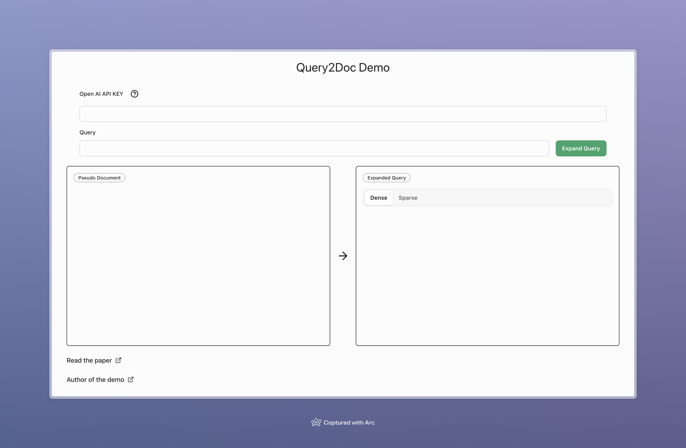

# Query2Doc Demo

This project is a demo application of the query2doc method, a query expansion technique that utilizes large language models (LLMs) to improve search performance. Query2doc generates pseudo-documents relevant to the input query using LLMs and expands the original query with these pseudo-documents.

## Requirements

- An OpenAI API key is required. To obtain an API key, create an account on the [OpenAI](https://www.openai.com/) website.

## Demo URL

The demo application is available at the following URL:

[https://query2doc-demo.pages.dev/](https://query2doc-demo.pages.dev/)



## Research Paper

For more details on query2doc, please refer to the following research paper:

[Query2doc: Query Expansion with Large Language Models](https://arxiv.org/abs/2303.07678)

## Overview of query2doc Query Expansion

The query expansion in query2doc is performed in the following steps:

1. The user enters a search query.
2. The LLM is requested to generate pseudo-documents relevant to the input query.
3. The original query is expanded using the generated pseudo-documents.
   - For dense retrieval, the original query and pseudo-documents are concatenated using a [SEP] token.
   - For sparse retrieval, the original query is repeated multiple times before concatenating with the pseudo-documents.
4. The expanded query is used to perform the search.

In this demo application, the OpenAI API is used to generate pseudo-documents from the GPT-3.5 model. The generated pseudo-documents are utilized for query expansion in both dense and sparse retrieval methods.

## Notes

- This demo application is intended to provide an understanding of the query2doc method. Further adjustments may be necessary for application in real-world search systems.
- The use of the OpenAI API incurs costs. Please be aware that you will be charged based on your API usage.

## References

- [Query2doc: Query Expansion with Large Language Models](https://arxiv.org/abs/2303.07678)
- [OpenAI API](https://www.openai.com/)
- [MS MARCO](https://microsoft.github.io/msmarco/)

---

# Welcome to Remix + Vite

📖 See the [Remix docs](https://remix.run/docs) and the [Remix Vite docs](https://remix.run/docs/en/main/future/vite) for details on supported features.

## Typegen

Generate types for your Cloudflare bindings in `wrangler.toml`:

```sh
npm run typegen
```

You will need to rerun typegen whenever you make changes to `wrangler.toml`.

## Development

Run the Vite dev server:

```sh
npm run dev
```

To run Wrangler:

```sh
npm run build
npm run start
```

## Deployment

> [!WARNING]  
> Cloudflare does _not_ use `wrangler.toml` to configure deployment bindings.
> You **MUST** [configure deployment bindings manually in the Cloudflare dashboard][bindings].

First, build your app for production:

```sh
npm run build
```

Then, deploy your app to Cloudflare Pages:

```sh
npm run deploy
```

[bindings]: https://developers.cloudflare.com/pages/functions/bindings/
